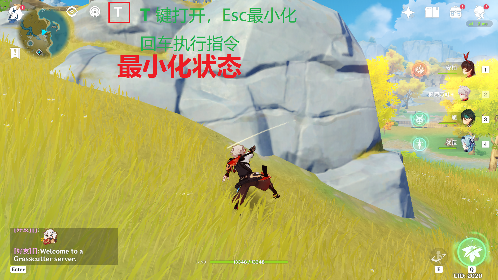
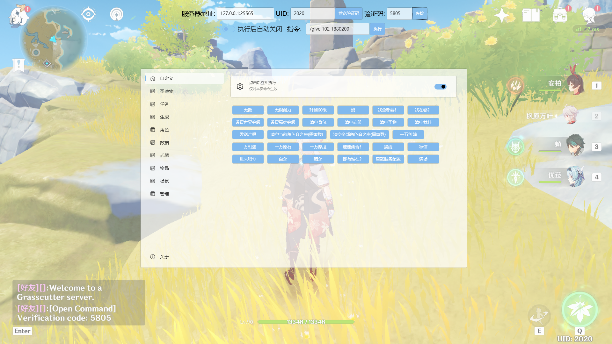
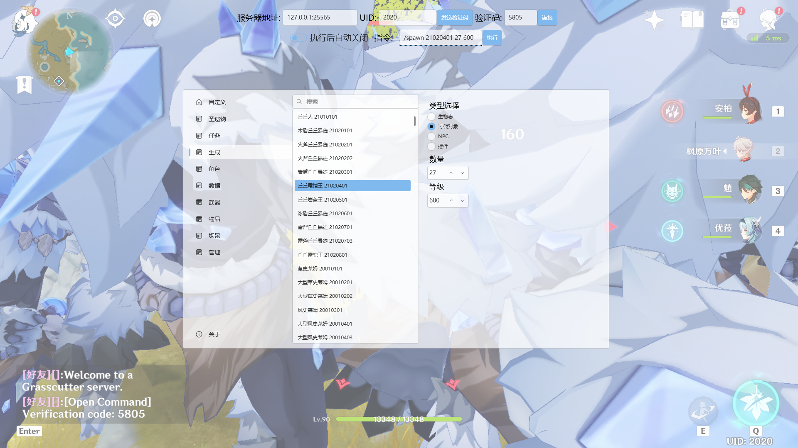
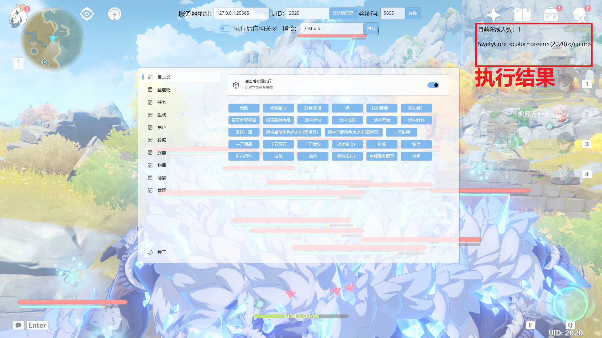

# GC-Command-Helper

便捷的指令生成 / 执行   **开发中。。。**

> ## 参考&基于 [https://github.com/jie65535/GrasscutterCommandGenerator](https://github.com/jie65535/GrasscutterCommandGenerator)
------

## Feature

 + 快速开关指令面板 （按 T 开启，Esc 关闭） 
 + 指令生成、远程执行 （需安装 GrasscutterCommandGenerator）

## Preview

## Todo
  - [x] 指令执行相关
    - [x] 对接 opencommand-api 
  - [ ] 指令生成相关 
    - [ ] 自定义指令
      - [x] 生成
      - [ ] 增删改
      - [ ] 立即执行
    - [ ] 实体生成
      - [x] 讨伐怪物指令
    - [x] 角色获取
    - [x] 角色面板指令
    - [ ] 角色技能等级指令
    - [ ] 其他 GrasscutterCommandGenerator 拥有的功能
    - [ ] 界面优化
    - [ ] 配置保存

## 使用方法
  1. 下载解压
  2. 启动原神 （必须要无边框方式启动，并且分辨率为 1920*1080） 
  3. 以管理员身份启动程序
  4. 输入 ip uid 发送验证码 进行连接
  5. Enjoy it！

<!-- ### 程序获取请到请到 [Actions](https://github.com/SwetyCore/GC-Command-Helper/actions) 下载最近编译的版本。 -->
## 程序获取
  程序不完整，有需求请自行构建
  功能完善后会发布

### 目前功能暂时不完善，请等待后续更新

